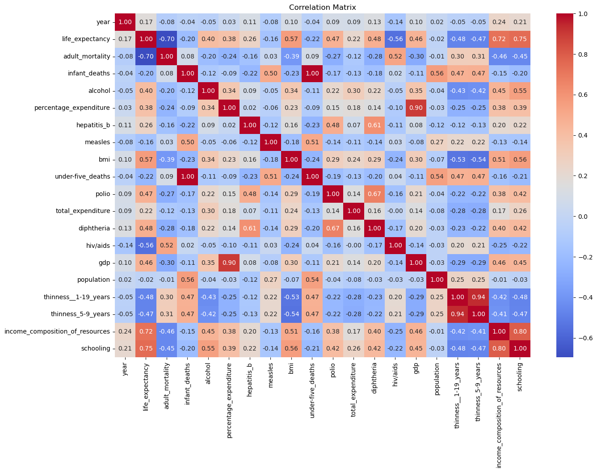
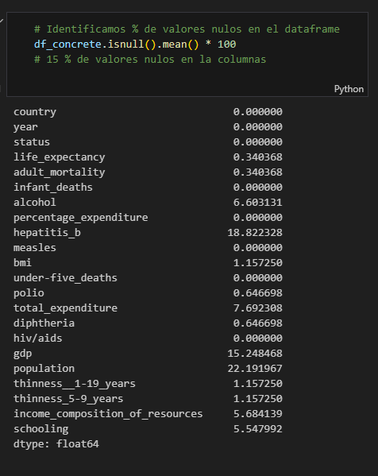

## Project

Life expectancy is a statistical measure of the average time a person is expected to live,  based on factors like their birth year, current age, and demographic data. It is important because it serves as a key indicator of a population's overall health, guiding public health policies, and helping to plan for future needs in healthcare, social security, and other services. 

## What life expectancy is
A statistical average: Life expectancy is not a prediction for an individual but a summary statistic that represents the average lifespan for a population, assuming current mortality rates remain constant.
Based on current mortality rates: It is calculated using the age-specific death rates of a given year to estimate how many years a newborn or a person of any other age can expect to live.
Influenced by many factors: It is affected by living standards, lifestyle, nutrition, access to healthcare, and environmental conditions. 

## Why life expectancy is important
Health indicator: It is a primary measure used to assess the general health of a population and compare it with other populations or groups.
Policy and planning: It informs crucial government and healthcare policies. For example, it is used to help set retirement ages and target health initiatives.
Social and economic planning: By understanding how life expectancy changes, governments and organizations can plan for future needs, such as the increasing number of people living with chronic illnesses, and anticipate demand for services and support systems.
Identifying disparities: Differences in life expectancy can highlight health disparities between different geographic areas, socioeconomic groups, or ethnic groups, prompting further investigation and action.

## Data:

I used the Life Expectancy dataset, collected by the WHO and the United Nations, assembled and available at: https://www.kaggle.com/datasets/kumarajarshi/life-expectancy-who/data
. 

## Goal

The main goal is straight-forward: build an end-to-end Machine Learning project:


## Tools:

- Python (pandas, numpy, plotly)
- Machine Learning: scikit-learn, XGBoost
- Virtual environment: venv
- Docker / Podman
- FastAPI
- Git

## Workflow

1. **Data Collection**: Download and load the Life Expectancy dataset from Kaggle
2. **Exploratory Data Analysis (EDA)**: Analyze the dataset structure, identify missing values, and visualize key patterns
3. **Data Preprocessing**: Clean the data, handle missing values, encode categorical variables, and normalize features
4. **Feature Engineering**: Create new features and select the most relevant ones for the model
5. **Model Training**: Train multiple machine learning models (Linear Regression, Random Forest, XGBoost) and compare their performance
6. **Model Evaluation**: Evaluate models using appropriate metrics (RMSE, MAE, R²) and select the best one
7. **Model Deployment**: Containerize the model using Docker/Podman and create a REST API with FastAPI
8. **Testing**: Test the API endpoints and validate predictions
9. **Documentation**: Document the code, API endpoints, and deployment instructions

## EDA

The WHO's Life Expectancy dataset comprises 22 features, including the life expectancy (target variable), the country name, the year of the record (2000-2015) and 19 are health-related, socioeconomic and demographic factors that could influence life expectancy:

- Life expectancy: measured in years
- Country
- Year: from 2000 to 2015
- Status: developing or developed country
- Population: number of inhabitants of the country
- Adult mortality: number of adult deaths per 1000 population, for both sexes
- Infant deaths: number of infant deaths per 1000 population
- Under-five deaths: number of under-five deaths per 1000 population
- GDP: Gross Domestic Product per capita (in USD)
- Percentage expenditure: expenditure on health as a percentage of Gross Domestic Product per capita (%)
- Total expenditure: general government expenditure on health as a percentage of total government expenditure (%)
- Income composition of resources: Human Development Index in terms of income composition of resources (index ranging from 0 to 1)
- Hepatitis B: hepatitis B (HepB) immunization coverage among 1-year-olds (%)
- Polio: polio (Pol3) immunization coverage among 1-year-olds (%)
- Diphteria: Diphtheria tetanus toxoid and pertussis (DTP3) immunization coverage among 1-year-olds (%)
- Measles: number of reported cases of measles per 1000 population
- HIV/AIDS: deaths per 1000 live births attributed to HIV/AIDS (0-4 years)
- Thinness 5-9: prevalence of thinness among children and adolescents for age 5 to 9 (%)
- Thinness 10-19: prevalence of thinness among children and adolescents for age 10 to 19 (%)
- BMI: average Body Mass Index of entire population
- Alcohol: recorded per capita (15+) consumption (in litres of pure alcohol)
Schooling: number of years of schooling

### Key Findings

The exploratory data analysis revealed important insights about the life expectancy dataset:






### Main Observations

- The dataset contains multiple years of data across different countries
- Strong correlations were found between life expectancy and factors like GDP, education, and healthcare indicators
- Missing values were identified in several columns and required careful handling
- Significant variations in life expectancy exist between developed and developing countries

## Scripts

This project include 3 scripts

- train : Load, Clean, Train, Hyperparameter model
- predict: Predict model
- ml-app: FastAPI app, predict service

## Install required dependencies:

```python
pip install requirements.txt

```

## Run app

Run script

```python

python ml-app.py

```

Run docker image

```bash

docker pull dberrocal/ml-zoomcamp:v0.0

```

Running APP

```
https://ml-zoomcamp-b4eyczfjfthagrb0.canadacentral-01.azurewebsites.net

```

## Test

There a POSTMAN collection 


```curl

curl --location 'http://localhost:8000/predict' \
--header 'Content-Type: application/json' \
--data '{
    "year": 2015.0,
    "adult_mortality": 263.0,
    "infant_deaths": 62.0,
    "alcohol": 0.01,
    "percentage_expenditure": 71.27962362,
    "hepatitis_b": 65.0,
    "measles": 1154.0,
    "bmi": 19.1,
    "under-five_deaths": 83.0,
    "polio": 6.0,
    "total_expenditure": 8.16,
    "diphtheria": 65.0,
    "hiv_aids": 0.2,
    "gdp": 584.25921,
    "population": 33736494.0,
    "thinness__1-19_years": 17.2,
    "thinness_5-9_years": 17.3,
    "income_composition_of_resources": 0.479,
    "schooling": 10.1,
    "country_idx": 0.0,
    "status_idx": 0.0
}'

```
